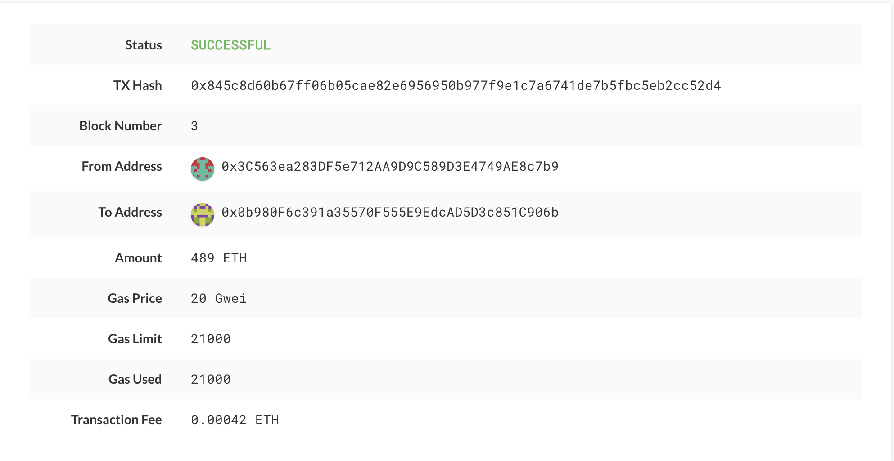

# Proof of Authority Development Chain

The following assumes you have geth installed in a "~/Projects/Blockchain-Tools/" path and are using the exising JSON file and nodes included in the repository, and your working directory is set to the repository folder.

## The steps to start this chain are as follows:

* Run ~/Projects/Blockchain-Tools/geth --datadir node1 --unlock "0x3C563ea283DF5e712AA9D9C589D3E4749AE8c7b9" --mine --rpc --allow-insecure-unlock
    * This command instructs geth to start node1, unlocking it using it's public address, setting it to mine, enables RPC, and allows for an insecure unlock. The password was set on creation and you should reach out to the repository creator for more details.

* Run ~/Projects/Blockchain-Tools/geth --datadir node2 --unlock "0x0b980F6c391a35570F555E9EdcAD5D3c851C906b" --mine --port 30304 --bootnodes "enode://832b657fa10f0e66f97816dc9fe9c36879dfd5bacc807a3f72f5883306f65a7498f749a9efb4967900d647b67fd931164cba27e08d6f6c6084347aea6238bc53@127.0.0.1:30303" --ipcdisable
    * This command instructs geth to start node2, unlocking it using it's public address, setting it to mine, sets it to operate on port 30305, points it to the bootnode address of node1, and disables ipc. The password was set on creation and you should reach out to the repository creator for more details.

## The network is configured as follows:

* The blocktime is set to `15 seconds`.

* The chain ID is `6653`.

* The password was set on creation and you should reach out to the repository creator for more details.

* The HTTP endpoint port of node1 was set to `8545` and what is used to connect.

## You can connect to the network and submit a successful transaction by doing the following:

* Ensure that the nodes as mentioned above are running.

* Open the MyCrypto app, then click `Change Network` at the bottom left:

* Click `Add Custom Node`, then add the custom network information.

* Make sure that you scroll down to choose `Custom` in the `Network` column to reveal more options like `Chain ID`:

    * Set the Node Name to `homework18`.

    * Set the Network Name to `homework18`.
    
    * Type `ETH` in the Currency box.
    
    * Set the Chain ID to `6653`.

    * In the URL box type: `http://127.0.0.1:8545`.  This points to the default RPC port on your local machine.

    * Finally, click `Save & Use Custom Node`. 

* Select the `View & Send` option from the left menu pane, then click `Keystore file`.

* On the next screen, click `Select Wallet File`, then navigate to the keystore directory inside your Node1 directory, select the file located there, provide the password when prompted and then click `Unlock`.

* In the `To Address` box, type `0x0b980F6c391a35570F555E9EdcAD5D3c851C906b` as the account address from Node2, then fill in an arbitrary amount of ETH

* Confirm the transaction by clicking "Send Transaction", and the "Send" button in the pop-up window.  

* Click the `Check TX Status` when the green message pops up, confirm the logout:

* You should see the transaction go from `Pending` to `Successful` in around the 15 second blocktime set in the genesis.

* You can click the `Check TX Status` button to update the status, and it should look like the below.

