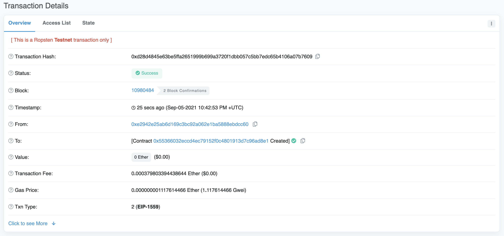
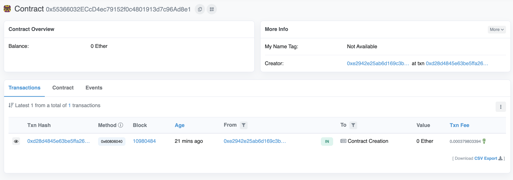
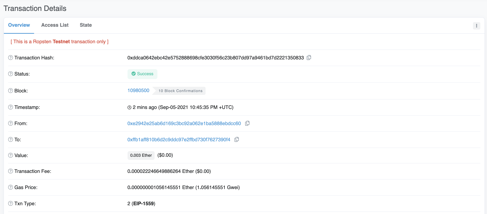
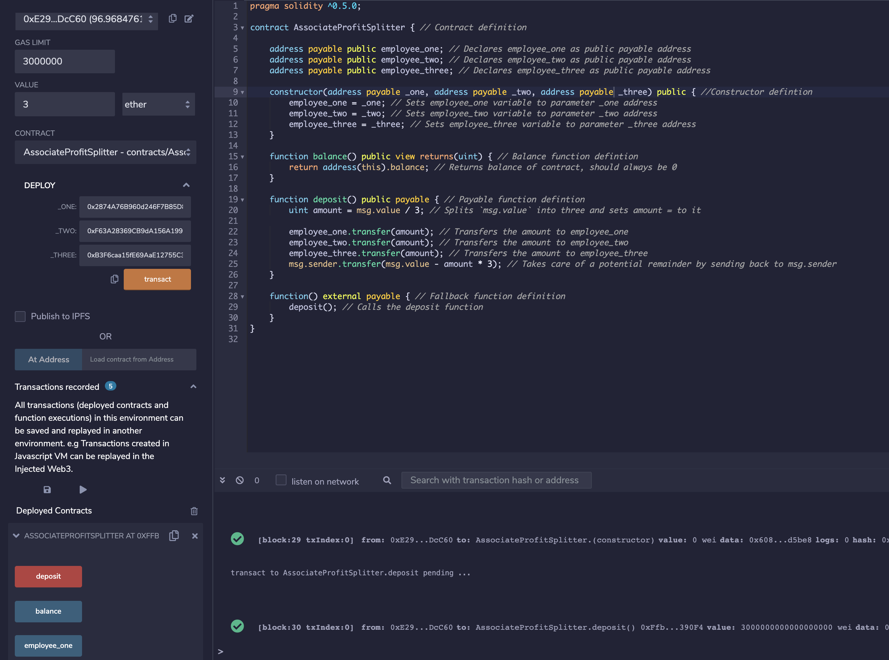
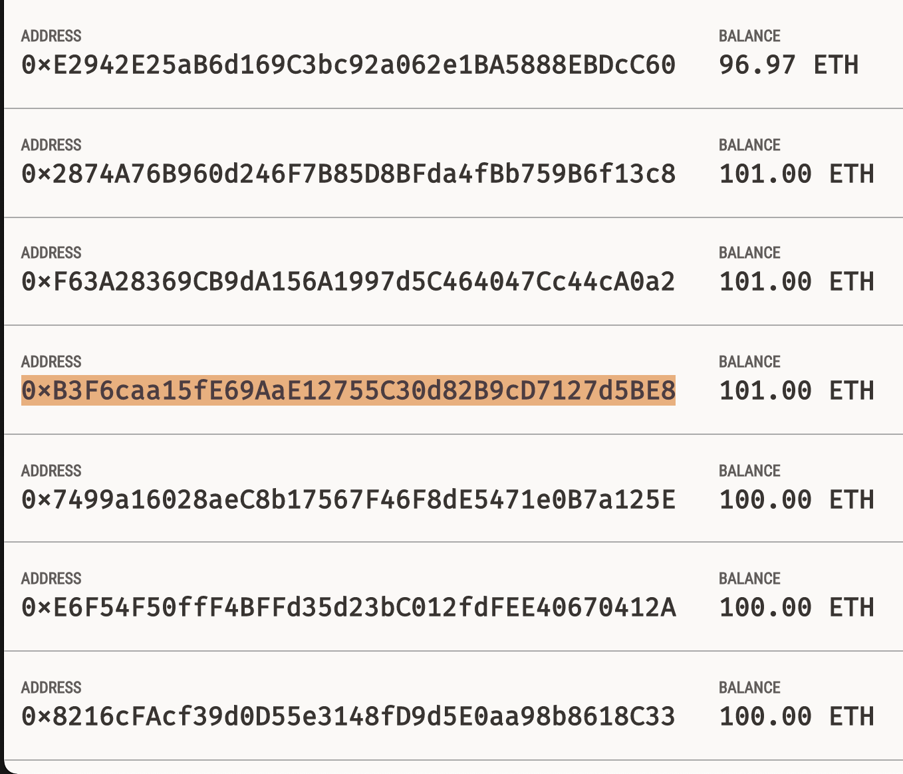
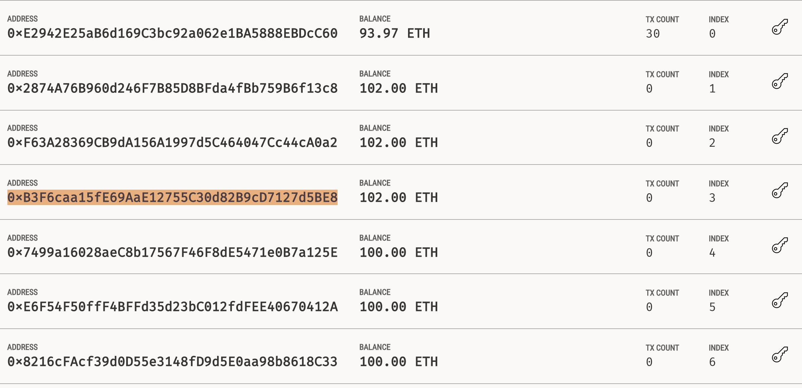

# Level One: The AssociateProfitSplitter Contract

This contract works by taking three addresses at the time of deployment. Any time value is sent to the contract or the deposit function is called, the value is evenly distributed between the three addresses and any remaining money is sent back to msg.sender. The motivation for this contract is to allow a Human Resources department to pay employees quickly and efficiently.

The transaction that shows the Ropsten deployment can be found here: [Ropsten Testnet Deployment Transaction](https://ropsten.etherscan.io/tx/0xd28d4845e63be5ffa2651999b699a3720f1dbb057c5bb7edc65b4106a07b7609)

The Ropsten contract address can be found here: [Ropsten Testnet Contract Address](https://ropsten.etherscan.io/address/0x55366032eccd4ec79152f0c4801913d7c96ad8e1)

contract_address

A record of a transaction interacting with this contract can be found here: [Ropsten Testnet Contract Interaction](https://ropsten.etherscan.io/tx/0xddca0642ebc42e5752888698cfe3030f56c23b807dd97a9461bd7d2221350833)

## Transactions

Transactions can be sent by using the Remix IDE. Once the contract is deployed, a user must enter a value into the **VALUE** field, then click the **deposit** button on the deployed contract.

Any funds sent to the contract are distributed amongst the 3 addresses that were declared on deployment, and any remaining money is returned to msg.sender.

In the below example, 3 ETH was sent to the contract from the first address, to be distributed to the 3 following addresses. Notice how the first addresses balance decreases by 3, and each of following addresses' balance increase by 1.

