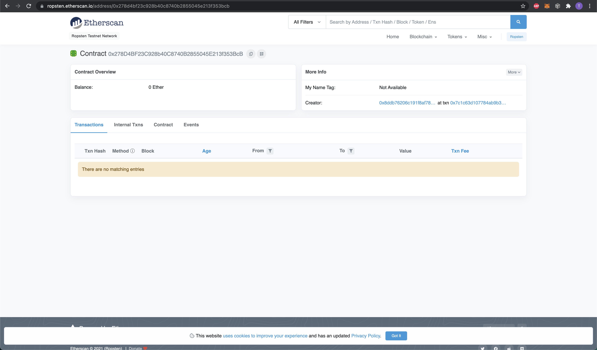
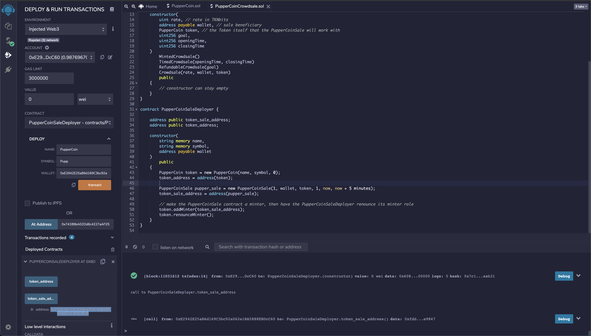
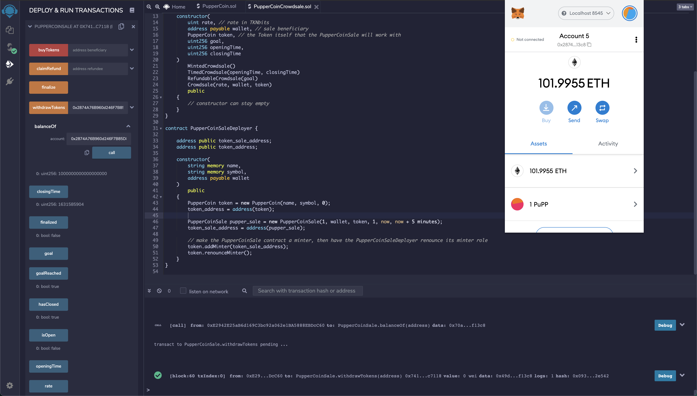
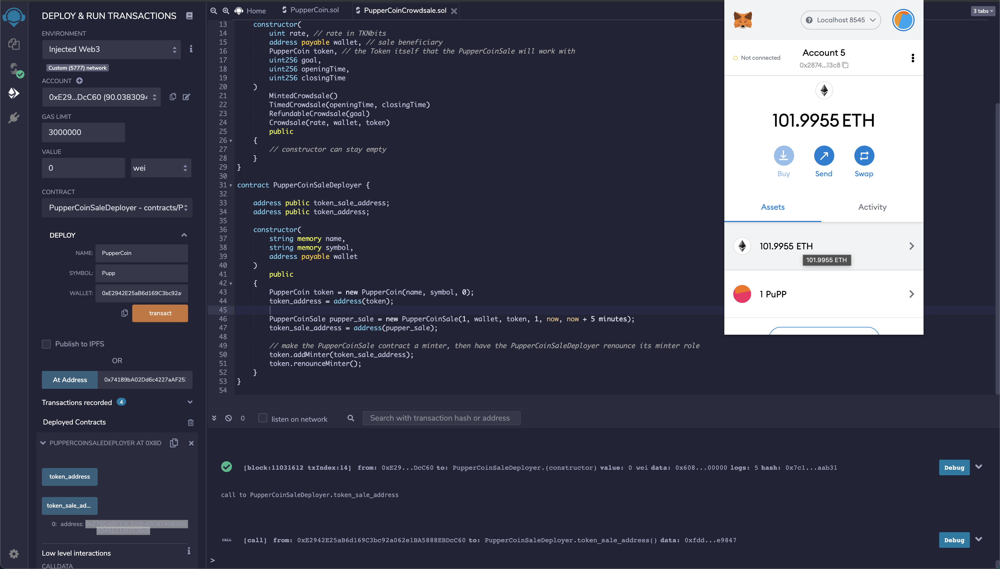

# Crowdsale

The transaction that shows the Ropsten deployment can be found here: [Ropsten Deployed Contract Address](https://ropsten.etherscan.io/address/0x278d4bf23c928b40c8740b2855045e213f353bcb)

The Ropsten contract address was found using the token_sale_address returned by the deployer.

The contract was tested locally. It was deployed using Address 1 in Ganache, and Address 2 paid for the coin.

To make testing easier, the code was changed to only have a time period of 5 minutes, and the funds required was changed to 1 ETH. Once the time had elapsed and Address 2 had sent the funds, the PupperCoinSale contract was loaded using the address in remix, and the finalize method was called.

After that, the withdrawTokens method was called on the contract, and the PupperCoin tokens appeared in Metamask.

